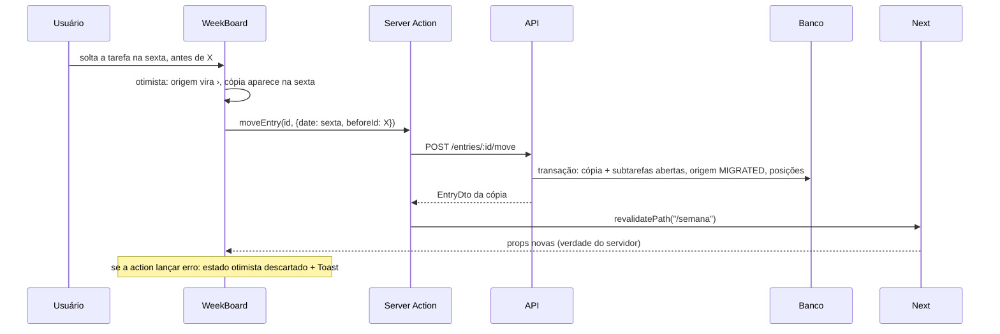
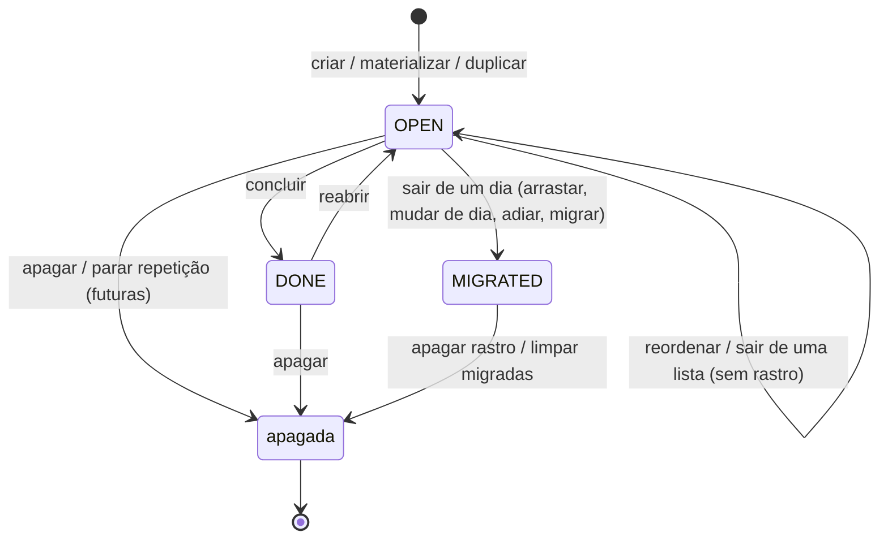

# Plano — Semana interativa (lista semanal do WeekToDo)

## Abordagem

**API primeiro, web depois.** O modelo `Entry`/`Collection`/`RecurrenceRule`/`RecurrenceInstance` já cobre tudo; faltam operações. A API ganha: árvore com subtarefas nas consultas por intervalo e por lista, um `POST /entries/:id/move` único (reordenar, migrar dia→X com rastro, realocar lista→X sem rastro), operações em lote (concluir, migrar, apagar, restaurar), duplicar, rotas de listas personalizadas e de recorrência, e **materialização de recorrências na leitura** (como o WeekToDo fazia ao abrir o dia), idempotente pela PK `(ruleId, date)` de `RecurrenceInstance`. As regras de negócio (onde encaixar um item arrastado, que tipo de movimento é, o que a cópia migrada leva, montar/descrever RRULE, quais ocorrências faltam) são módulos puros em `apps/api/src/modules/journal/` com vitest ao lado.

**Web: casca no servidor, quadro no cliente.** `app/semana/page.tsx` continua Server Component: resolve "hoje" pela API, busca semana/listas/regras/metas em paralelo e entrega a um `WeekBoard` client. As partes que não mudam com arrastar (hábitos, sequência, metas, coleções) continuam renderizadas no servidor e entram no `WeekBoard` como `ReactNode` (slots), para que colunas, painel e laterais interativas (pendentes, repetidas) compartilhem um só estado otimista. Toda gravação é Server Action (`lib/actions.ts`) chamada dentro de `startTransition`, com `useOptimistic`: o reducer aplica a mudança na hora, a action grava e dá `revalidatePath("/semana")`, e se a action lançar erro o React descarta o estado otimista e o `Toast` avisa.

**Arrastar com `@dnd-kit`.** Um `DndContext` cobre dias e listas (padrão "multiple containers"): cada coluna é um `SortableContext`; sensores de ponteiro, toque (atraso de 250 ms para não brigar com a rolagem) e teclado. Ao soltar, o cliente manda só `{ id, destino, beforeId }`; **a posição final é calculada no servidor** (`reposition`), que aplica a regra 1B. O reducer otimista não reimplementa a ordenação: insere no ponto do soltar (ou no fim das manuais) e o revalidate corrige. Subtarefas no painel têm um `DndContext` próprio.

**Recorrência no formato do WeekToDo.** A regra nasce de uma tarefa de um dia (que vira a primeira ocorrência), guarda o molde e as opções amigáveis no `template` (Json) e não é editável: para mudar, para-se e cria-se de novo. Materializa só de hoje em diante (`max(from, hoje)`), no intervalo pedido, limitado a 62 dias.

## Decisões técnicas

| Decisão | Escolha | Alternativas | Por quê |
|---|---|---|---|
| Biblioteca de arrastar | `@dnd-kit/core` + `@dnd-kit/sortable` + `@dnd-kit/utilities` | HTML5 drag nativo (como o WeekToDo); `react-beautiful-dnd` | O nativo não funciona com toque (a spec exige celular); rbd está descontinuado. dnd-kit tem toque, teclado e múltiplos containers. |
| Onde a posição é calculada | Servidor, `modules/journal/ordering.ts#reposition` | Cliente manda a lista inteira ordenada | Uma regra só (1B) e testável; o cliente não precisa conhecer tarefas com hora nem concluídas. |
| Uma rota de mover | `POST /entries/:id/move { date? \| collectionId?, beforeId? }` | PATCH com data/posição; rotas separadas para reordenar/migrar | O tipo de movimento depende da origem (dia → rastro; lista → sem rastro) e decide-se num lugar, dentro de uma transação. |
| PATCH | Deixa de aceitar `date`, `collectionId`, `parentId`, `id`, `source`, `position`; `kind` sem default | Manter aceitando e ignorando | Hoje o contrato aceita e ignora em silêncio, e o default de `kind` faz todo PATCH gravar `TASK` (verificado com zod 4.6.5). Mover passa a ser só pelo `/move`. Android e web não mandam esses campos. |
| Ações de dia e de semana | `POST /entries/batch` com `action: complete \| migrate \| delete \| restore` | Uma rota por ação | Concluir todas, adiar pendentes, migrar para hoje, limpar migradas e desfazer são a mesma forma: "estes ids". |
| Materializar recorrência | Na leitura (`GET /entries?date=`, `?from&to`, `/daily-summary`), uma transação por ocorrência, ignorando P2002 | Job agendado; materializar na criação da regra | É o comportamento do WeekToDo; o Diário e o Android recebem de graça pelo `/daily-summary`; a PK `(ruleId, date)` garante uma vez só. |
| Editar regra | Não se edita; parar (`DELETE /recurrence-rules/:id`) e criar de novo | Editar e recalcular futuras | Paridade com o WeekToDo e muito menos casos de borda. |
| Opções da regra | Guardadas em `template.options` (formato `RecurrenceInput`) | Parsear a RRULE de volta | O DTO devolve as opções sem parser; a RRULE fica só para expandir. |
| Rotas do journal | `routes/entries.ts` + `routes/lists.ts` + `routes/recurrence.ts` | Tudo em `entries.ts` | `entries.ts` passaria de 500 linhas. `recurrence.ts` **não importa** de `entries.ts` (evita ciclo); `entries.ts` e `lists.ts` importam dele. |
| Markdown das notas | `react-markdown` sem `rehype-raw` | `marked` + sanitizar; texto puro | Seguro por padrão (não injeta HTML) e basta para "formatação simples". |
| Cor da tarefa | Hex forte da `PALETTE` (`components/palette.ts`), ex. `#1971c2`; `null` = sem cor | Nome do tom (`"blue"`) | O Android consegue pintar hex sem conhecer a paleta da web. |
| "Hoje" na web | Sempre o `date` devolvido pela API (`/habits/today`), passado como prop | `new Date()` no navegador | Fuso da API é a verdade (mesmo truque que a página já usa). |
| Clique × duplo clique no texto | Clique abre o painel após 250 ms, a menos que venha o segundo clique (edita inline) | Botão "⋯" separado | Paridade com o WeekToDo (`ClickHandler`) e funciona no toque (lá não existe duplo clique: toque abre o painel). |

## Contratos

### `packages/shared/src/index.ts`

```ts
// EntryBase ganha:
recurrenceRuleId: z.string().nullable(),

export const UpdateEntryInput = CreateEntryInput
  .omit({ id: true, date: true, collectionId: true, parentId: true, source: true })
  .partial()
  .extend({ kind: EntryKind.optional(), status: EntryStatus.optional(),
    // emenda 2026-09-25 (WP08): `null` limpa — o painel precisa tirar hora, cor, notas e meta
    description: z.string().nullable().optional(), time: hhmm.nullable().optional(),
    color: z.string().nullable().optional(), goalId: z.string().nullable().optional(),
    mediaItemId: z.string().nullable().optional() }); // sem `position`
// `kind` redeclarado SEM default: no zod 4, `.partial()` mantém o `.default("TASK")`,
// e hoje todo PATCH chega com kind=TASK — concluir um evento/nota o vira tarefa (bug atual).

export const MoveEntryInput = z.object({
  date: isoDate.optional(),                  // destino: um dia
  collectionId: z.string().optional(),       // destino: uma lista personalizada
  beforeId: z.string().nullable().optional() // soltar antes deste; ausente/null = fim das manuais
}).refine((v) => !(v.date && v.collectionId), { message: "date ou collectionId, não os dois" });

const Ids = z.array(z.string()).min(1).max(200);
export const EntryBatchInput = z.discriminatedUnion("action", [
  z.object({ action: z.literal("complete"), ids: Ids }),
  z.object({ action: z.literal("migrate"), ids: Ids, date: isoDate }),
  z.object({ action: z.literal("delete"), ids: Ids }),
  z.object({ action: z.literal("restore"), ids: Ids }),
]);

export const RecurrenceInput = z.object({
  freq: z.enum(["DAILY", "WEEKLY", "WEEKDAYS", "MONTHLY", "YEARLY"]),
  interval: z.number().int().min(1).max(99).default(1),
  weekdays: z.array(z.number().int().min(1).max(7)).optional(),   // WEEKLY; vazio = dia da tarefa (1 = seg)
  monthDays: z.array(z.number().int().min(1).max(31)).optional(), // MONTHLY; vazio = dia da tarefa
  end: z.discriminatedUnion("type", [
    z.object({ type: z.literal("never") }),
    z.object({ type: z.literal("count"), count: z.number().int().min(1).max(999) }),
    z.object({ type: z.literal("until"), date: isoDate }),
  ]).default({ type: "never" }),
});
export const RecurrenceRuleDto = z.object({
  id: z.string(), text: z.string(), summary: z.string(), // summary: "toda segunda · até 31/12/2026"
  startDate: isoDate, endDate: isoDate.nullable(), options: RecurrenceInput,
});

export const CustomListDto = z.object({
  id: z.string(), name: z.string(), color: z.string().nullable(), sortOrder: z.number().int(),
  entries: z.array(EntryDto),
});
export const CreateListInput = z.object({ name: z.string().trim().min(1).max(60), color: z.string().optional() });
export const UpdateListInput = CreateListInput.partial();
export const ReorderListsInput = z.object({ ids: z.array(z.string()).min(1) });
// + os `export type X = z.infer<typeof X>` correspondentes
```

Android (`Dto.kt`): `EntryDto` ganha `val recurrenceRuleId: String? = null`. Nenhuma outra mudança lá.

### Rotas da API

| Rota | Arquivo | Comportamento |
|---|---|---|
| `GET /entries?date=` | entries | **Materializa** a data (se ≥ hoje) antes de listar. Resto igual. |
| `GET /entries?from&to` | entries | **Materializa** `[max(from, hoje), to]`; devolve **raízes com `children`** (mesmo formato de `?date=`), incluindo migradas e canceladas. Intervalo > 62 dias → 400. |
| `GET /entries?collectionId=` | entries | Devolve raízes com `children`. |
| `PATCH /entries/:id` | entries | Contrato reduzido (acima). Lógica igual, sem `position`. |
| `POST /entries/:id/move` | entries | Ver "Mover" abaixo. 200 com o `EntryDto` que ficou no destino (a cópia, se migrou). |
| `POST /entries/:id/migrate` | entries | Mantido para Diário/Android: vira atalho de "mover para `date`, fim das manuais". Continua 201. Passa a exigir tarefa aberta e raiz (409 senão). |
| `POST /entries/:id/duplicate` | entries | Só raiz (400 para subtarefa). Cópia `OPEN` no mesmo lugar, no fim, com todas as subtarefas reabertas; sem `recurrenceRuleId` nem `migratedFromId`. 201. |
| `POST /entries/batch` | entries | `complete`: raízes `OPEN` → `DONE` + `completedAt`. `migrate`: cada raiz `OPEN`, em ordem de posição, migra para `date` numa transação. `delete`: `deletedAt = now`. `restore`: `deletedAt = null`. Sempre filtrando `userId`; responde `{ ids }` dos afetados. |
| `DELETE /entries/:id` | entries | Igual. |
| `GET /lists` | lists | `{ lists: CustomListDto[] }`: `CUSTOM`, não apagadas, não arquivadas, por `sortOrder`, com árvore de entradas. |
| `POST /lists` | lists | Cria no fim (`sortOrder = max + 1`). 201 `CustomListDto`. |
| `PATCH /lists/:id` | lists | Renomeia/recolore. |
| `PUT /lists/order` | lists | `sortOrder = índice` para os ids do usuário. 204. |
| `DELETE /lists/:id` | lists | Transação: `deletedAt` na lista e nas entradas dela. 204. |
| `GET /recurrence-rules` | recurrence | `{ rules: RecurrenceRuleDto[] }`: ativas e não apagadas, por `createdAt`. |
| `PUT /entries/:id/recurrence` | recurrence | Body `RecurrenceInput`. Exige raiz `OPEN` numa coleção `DAILY` e sem regra (409). Transação: cria a regra (`rrule = buildRRule`, `startDate = entry.date`, `endDate = ruleEndDate`, `template`), liga a entrada (`recurrenceRuleId`) e cria `RecurrenceInstance(rule, entry.date, entry.id)`. 201 `RecurrenceRuleDto`. |
| `DELETE /recurrence-rules/:id` | recurrence | Transação: regra `active = false` + `deletedAt`; entradas da regra com `date ≥ hoje` e `OPEN` → `deletedAt`; as demais → `recurrenceRuleId = null`. 204. |

`/collections` (GET/POST) continua como está, sem uso novo.

**Mover (`POST /entries/:id/move`), dentro de uma transação:**
1. Carrega a entrada (do usuário, não apagada) com a coleção.
2. Subtarefa (`parentId`): só reordena entre irmãs; `date`/`collectionId` no corpo → 400.
3. Destino: `date` → `ensureDailyCollection`; `collectionId` → coleção `CUSTOM` do usuário, não apagada (404); nenhum → a atual.
4. `kind = moveKind(origem, destino)`. Se não for `reorder` e `!canLeaveCollection(entry)` → 409.
5. `reorder`: `reposition(irmãs, id, beforeId)` e grava as posições que mudaram (`reposition` devolve `[]` para tarefa com hora ou fechada: nada a fazer, 200).
6. `migrate`: cria `migrationCopy(...)` no destino, marca a origem `MIGRATED` e reposiciona a cópia entre as irmãs do destino.
7. `relocate`: atualiza `collectionId`/`date` da entrada **e das subtarefas** e reposiciona no destino.

**Materialização** (`materializeRecurrences(userId, from, to, today)` em `routes/recurrence.ts`, exportada): `lo = max(from, today)`; sai se `lo > to`. Carrega regras ativas do usuário com `startDate ≤ to` e (`endDate` nulo ou `≥ lo`), e as `RecurrenceInstance` delas em `[lo, to]`; `plannedOccurrences(...)` diz o que falta. Para cada `(ruleId, date)`: uma `prisma.$transaction` que faz upsert da coleção DAILY (via `tx`), cria a entrada a partir do `template` (no fim do dia, com as subtarefas do molde, `recurrenceRuleId`, `source: "SYSTEM"`) e cria a `RecurrenceInstance`. Erro P2002 (outro aparelho criou antes) → ignora aquela ocorrência. `listEntriesForDate` chama `materializeRecurrences(userId, date, date)` antes de consultar; o range chama para o intervalo.

**Formato do `RecurrenceRule.template` (Json):** `{ kind, text, description, time, alarm, priority, color, tags, goalId, mediaItemId, children: [{ kind, text }], options: RecurrenceInput }`.

### Regras puras (`apps/api/src/modules/journal/`)

- `ordering.ts`: `sortEntries` fica como está (já implementa 1B). Novos: `isManual(e)` = `status === "OPEN" && time == null`; `reposition(siblings, movingId, beforeId): { id, position }[]` — ordena com `sortEntries` sem o item; se o item não é manual, devolve `[]`; insere antes de `beforeId` se ele for manual, senão no fim do grupo manual (antes da primeira fechada); renumera 0..n-1 e devolve só quem mudou.
- `moves.ts` (novo): `moveKind(from, to)` → `"reorder" | "migrate" | "relocate"` (mesma coleção → reorder; origem `DAILY` → migrate; senão relocate); `canLeaveCollection(e)` = `OPEN` e sem `parentId`; `migrationCopy(src, children, target)` → dados da cópia (kind, text, description, time, alarm, priority, color, tags, goalId, mediaItemId, `migratedFromId = src.id`, `source: "SYSTEM"`, sem regra) e das subtarefas **abertas** (kind, text, description, time, priority, color, tags; posições 0..); `duplicateCopy(src, children)` → cópia `OPEN` com todas as subtarefas reabertas.
- `recurrence.ts`: mantém `occurrencesBetween`/`rulesDueOn`; novos: `buildRRule(opts, startDate)` (sem DTSTART; `WEEKDAYS` = `FREQ=WEEKLY;BYDAY=MO,TU,WE,TH,FR`; `WEEKLY` sem dias = dia da semana do início; `MONTHLY` sem dias = dia do início; `count` → `COUNT`, `until` → `UNTIL=AAAAMMDDT235959Z`), `ruleEndDate(opts, startDate)` (until → a data; count → última ocorrência; never → null), `describeRule(opts, startDate)` em pt-BR ("todo dia", "a cada 2 dias", "toda segunda", "seg, qua e sex", "dias úteis", "todo dia 15", "dias 1 e 15 de cada mês", "todo ano em 25/12", sufixos " · 10 vezes" / " · até 31/12/2026"), `plannedOccurrences(rules, existing: Set<"ruleId|date">, from, to)`.

### Web

- `lib/api.ts`: `getEntriesRange` (já existe; agora vem com `children`), `getLists()`, `getRecurrenceRules()`.
- `lib/actions.ts`: `revalidateJournal()` (= `/` e `/semana`) passa a ser usado pelas actions de journal existentes também. Novas, com argumentos tipados (chamadas de componente client, não de `<form>`): `createEntry(input: CreateEntryInput)` (o cliente gera o `id` com `crypto.randomUUID()`), `updateEntry(id, patch)`, `moveEntry(id, input: MoveEntryInput)`, `batchEntries(input)`, `duplicateEntry(id)`, `setRecurrence(id, input)`, `stopRecurrence(ruleId)`, `createList(input)`, `updateList(id, input)`, `reorderLists(ids)`, `deleteList(id)`. Erro da API → a action lança (o cliente reverte).
- `lib/dates.ts`: `monthGrid(s)` (semanas seg–dom do mês de `s`, com dias de borda), `addMonths(s, n)`, `firstOfMonth(s)`.
- `app/semana/page.tsx`: busca `getHabitsToday(date)` → dias; em paralelo `getEntriesRange`, `getLists`, `getRecurrenceRules`, `getGoals`; monta `entriesByDay` e renderiza `WeekNav` no `PageHead` e `WeekBoard` com os slots de servidor (hábitos; sequência, metas e coleções da lateral).
- `components/week/` (todos `"use client"`, exceto `weekState.ts`, que é módulo puro):
  - `WeekBoard.tsx` — estado otimista, `DndContext`, grade de dias, `CustomLists`, painel, laterais interativas, `Toast`.
  - `weekState.ts` — tipo do estado (`days: Record<date, EntryDto[]>`, `lists: CustomListDto[]`, `rules`) e reducer das ações otimistas.
  - `Column.tsx` — cabeçalho (dia ou lista) + `SortableContext` + `NewEntryInput`.
  - `EntryRow.tsx` — `Bullet` de `components/paper.tsx` com glifo clicável, clique/duplo clique, edição inline e selos (hora, cor, *, 1/3, ¶ nota, ↻); ação "apagar rastro" em migradas.
  - `NewEntryInput.tsx`, `Toast.tsx` (mensagem + ação "desfazer" opcional, 6 s).
  - `WeekNav.tsx` + `MiniCalendar.tsx` — ‹ hoje › e o calendário em popover (navega com `router.push("/semana?date=…")`; destaca a semana vista e hoje).
  - `EntryPanel.tsx` (+ `Notes.tsx`, `SubtaskList.tsx`, `RecurrencePicker.tsx`) — gaveta à direita (`md:` 420 px; abaixo disso tela cheia). Cada campo grava ao mudar/sair.
  - `ColumnMenu.tsx` — menu do dia/lista.
  - `PendingAside.tsx` (pendentes de dias passados + "migrar todas para hoje" + "limpar migradas desta semana (N)") e `RecurringAside.tsx` (regras + "parar").
  - `CustomLists.tsx` — linha de listas abaixo dos dias + "nova lista".

## Arquivos

**Criados**
- `apps/api/src/modules/journal/moves.ts`, `moves.test.ts`, `ordering.test.ts`, `recurrence.test.ts` — regras puras e testes.
- `apps/api/src/routes/lists.ts`, `apps/api/src/routes/recurrence.ts` — rotas novas do journal.
- `apps/web/components/week/*` — os componentes listados acima.

**Modificados**
- `packages/shared/src/index.ts` — contratos acima.
- `apps/android/app/src/main/java/dev/indice/app/data/api/Dto.kt` — `recurrenceRuleId`.
- `apps/api/src/modules/journal/ordering.ts`, `recurrence.ts` — funções novas.
- `apps/api/src/routes/entries.ts` — árvore, mover, lote, duplicar, PATCH reduzido, materialização.
- `apps/api/src/app.ts` — registra `listsRoutes` e `recurrenceRoutes`.
- `apps/web/package.json`, `package-lock.json` — `@dnd-kit/*`, `react-markdown`.
- `apps/web/lib/api.ts`, `apps/web/lib/actions.ts`, `apps/web/lib/dates.ts`, `apps/web/app/semana/page.tsx`.
- `README.md` — tabela de endpoints.
- `.claude/specs/schema.md` — formato do `template` da regra.

**Explicitamente não tocados**
- `packages/db/prisma/schema.prisma` e migrações — o banco não muda.
- `apps/api/src/routes/daily-summary.ts` — ganha a materialização de graça via `listEntriesForDate`.
- `apps/web/app/page.tsx` (Diário) — continua com seus `<form>`; só as actions que ele usa passam a revalidar `/semana` também.
- `apps/web/components/paper.tsx` — `Bullet` é reaproveitado como está.
- `apps/android/**` fora do `Dto.kt` — sem tela nova.
- `packages/db/src/seed.ts` — sem dados de exemplo novos.

## Banco de dados

Não altera o banco. Schema atual em `.claude/specs/schema.md`. O `template` Json de `RecurrenceRule` passa a ter o formato descrito em "Contratos" (sem migração: coluna Json); a WP06 atualiza a descrição no `schema.md`.

## Fluxo principal — arrastar de segunda para sexta



## Estados



"Apagada" é só `deletedAt`: o status não muda, então "desfazer" (`restore`) devolve a tarefa ao estado que ela tinha (aberta, concluída ou migrada), com as subtarefas.

## Riscos

| Risco | Mitigação |
|---|---|
| Ciclo de import entre rotas | `recurrence.ts` não importa de `entries.ts`; faz o upsert da coleção DAILY com o `tx` dele. |
| GET com efeito colateral (materialização) duplicando em corrida | Uma transação por ocorrência + PK `(ruleId, date)`; P2002 ignorado. |
| Custo da materialização a cada carga | Só regras ativas do usuário, só `[max(from, hoje), to]`, teto de 62 dias. |
| Estado otimista divergir do servidor | O reducer é mínimo; o revalidate substitui as props; a ordem final é sempre a do servidor. |
| Arrasto no toque brigando com a rolagem | `TouchSensor` com `delay: 250, tolerance: 5`. |
| `COUNT` + materializar só de hoje em diante | Correto por definição: ocorrências passadas não criadas contam no `COUNT` (é "N vezes a partir do início"). |
| Web sem testes automatizados | Regras críticas estão na API (vitest); cada WP web tem roteiro manual; WP17 roda o aceite completo. |
| `Dto.kt` fora de sincronia | WP01 muda os dois juntos; `ignoreUnknownKeys` já protege o app antigo. |

## Testes

- **Automatizado (vitest, `npm run test`):** `ordering.test.ts` (1B: fechadas no fim, com hora antes, hora crescente, posição; `reposition` antes de manual, antes de item com hora → fim das manuais, item com hora → `[]`, só devolve quem mudou), `moves.test.ts` (`moveKind` nos 3 casos, `canLeaveCollection`, cópia leva só subtarefas abertas e não leva regra, duplicata reabre tudo), `recurrence.test.ts` (cada `freq`, intervalo, dias da semana, dias do mês com 31 em fevereiro, `COUNT`/`UNTIL`, `ruleEndDate`, `describeRule`, `plannedOccurrences` pulando existentes e respeitando `from`).
- **Manual (API):** roteiro `curl` com `X-Api-Key: dev-local-key` em cada WP de rota.
- **Manual (web):** roteiro por WP; na WP17, todos os itens de "Está pronto quando" da spec, em desktop e em viewport de celular (Playwright/Chromium do ambiente serve para capturas).

## Fora de escopo técnico

- Testes de rota com banco (Fastify `inject` + Postgres do CI) — registrado no INBOX.
- Editar regra de recorrência; recorrência em listas personalizadas.
- Tela semanal no Android.
- Reescrever o Diário (`app/page.tsx`) com os componentes novos.
