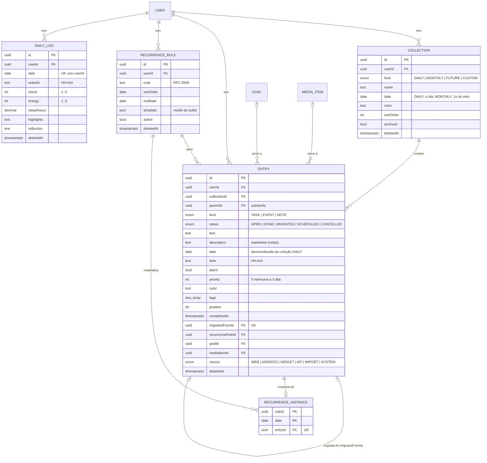

# Banco de dados

Visão legível do banco para as specs. O schema executável é
`packages/db/prisma/schema.prisma`: toda WP que altera o banco muda os dois no
mesmo commit da migração.

O `plan.md` de cada feature mostra apenas o **delta** — nunca uma cópia deste
arquivo.

**Cobertura parcial (adoção do fluxo em 2026-09-25):** por ora só o domínio
**Journal**, que é o que a primeira feature toca. Financeiro, Hábitos, Metas e
Mídia entram aqui quando uma feature mexer neles; até lá, consulte o
`schema.prisma`.

Convenções do projeto: toda tabela de dado de usuário tem `userId` e toda
consulta filtra por ele; soft delete por `deletedAt`; datas de calendário em
`@db.Date`; saldos e contadores nunca gravados, sempre derivados.

## Diagrama — Journal

## Regras de integridade — Journal

- **Uma coleção DAILY por dia** (e uma MONTHLY por mês) por usuário: é criada sob demanda quando o dia recebe o primeiro bullet.
- **Todo bullet pertence a uma coleção.** `entry.date` repete a data da coleção DAILY para consultas por intervalo; ao mover um bullet de dia, coleção e data mudam juntas.
- **Subtarefa é um bullet com `parentId`**, na mesma coleção e data do pai. Apagar o pai de verdade apaga as subtarefas (`ON DELETE CASCADE`); no uso normal o apagar é lógico (`deletedAt`).
- **Migração (• → ›)** cria um bullet novo no dia-alvo, que aponta para a origem por `migratedFromId` (único: cada origem migra uma vez); a origem fica `MIGRATED`. Se a origem sumir, o vínculo vira nulo.
- **Meta, mídia e regra de recorrência são vínculos opcionais**: apagar qualquer um deles deixa o bullet e só limpa o vínculo (`SET NULL`).
- **Uma regra de recorrência materializa no máximo um bullet por data** (`RecurrenceInstance` com chave `ruleId + date`), mesmo com dois dispositivos abrindo o mesmo dia.
- **Um registro de diário (humor, energia, reflexão) por dia** por usuário.
- **Excluir o usuário apaga tudo dele** (`ON DELETE CASCADE` a partir de `User`).

## Histórico de migrações

| Data | Feature | Mudança | Tipo |
|---|---|---|---|
| 2026-09-18 | (pré-SDD) | `20260918200928_init`: schema inicial completo | aditiva |
